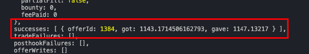
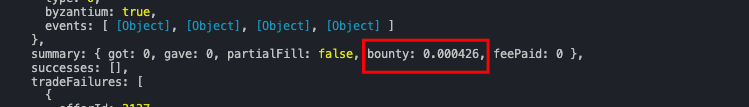

# Snipe An Offer

This tutorial will go through sniping an offer using mangrove.js

## Prerequisites

The tutorial assumes knowledge of javascript. If you haven't [set up your local environment](preparation.md), then start by setting that up.

Make sure to use a chain where Mangrove is live. You can find all all live addreses for Mangrove [here](../../contracts/technical-references/contract-addresses.md)

Open your favorite javascript editor inside your tutorial folder$.

### Import and connect

1. The first thing needed is to import `dotenv`, this handles the `.env` file you added in the [preparation](./preparation.md).
2. Then import both `Mangrove` and `ethers` from the Mangrove package. `ethers` will allow you to connect to a node and your wallet. `Mangrove` will allow you to connect to the Mangrove protocol.
3. In order to connect to a chain you need a `RPC_URL`, this should have been set up in the `.env` file doing the [preparation](./preparation.md).
    - If you do not want to use a real chain, you can start up a local chain using `anvil` as descriped in [preparation](./preparation.md). If you do this, you have to replace `RPC_URL` with `LOCAL_URL`. This way you will be running on the local chain and not the real chain. Remember to start anvil in its own terminal.
4. The same goes for connecting to your wallet, the `PRIVATE_KEY` is need in order to connect to your wallet.
    - You can also replace the `PRIVATE_KEY` with a key provided by anvil, if you don't want yo use your own account or simple don't have an account on the chain.
5. Once you have connected your wallet, you can connect to the Mangrove protocol using your wallet.

```javascript reference
https://github.com/mangrovedao/mangrove-ts/blob/9f60ed78cba2d43f323be400f8e5a7f17c4dcd68/packages/mangrove.js/examples/tutorials/snipe-offer.js#L1-L13
```

### Connect to market (and mint tokens)

You then need to connect to a market and check if it is live and has offers.

1. Connect to the market using `mgv.market`, with a base as `DAI` and a quote as `USDC`.
2. Console log asks. This outputs the 50 best asks.
   - This is to check if the market is live and has offers.
3. This step is only if you are running on a testnet and don't have any `USDC` tokens.
   - Mint 10.000 `USDC` to your ADMIN_ADDRESS. Do this by uncommenting the code that mints `USDC`.
  
```javascript reference
https://github.com/mangrovedao/mangrove-ts/blob/9f60ed78cba2d43f323be400f8e5a7f17c4dcd68/packages/mangrove.js/examples/tutorials/snipe-offer.js#L15-L24
```

### Snipe best offer

To snipe the best offer, you need to find the best offer and snipe it.

1. Before sniping any offers, you need to approve Mangrove to take the funds from your account.
2. You then need to get all asks from the market
3. Get the best offer from all asks.
4. And extract all the info for the offer.
   - You can then log the offer to see how an offer looks
5. Then snipe the offer using `market.snipe`.

```javascript reference
https://github.com/mangrovedao/mangrove-ts/blob/9f60ed78cba2d43f323be400f8e5a7f17c4dcd68/packages/mangrove.js/examples/tutorials/snipe-offer.js#L26-L44
```

### Check the result of sniping

After sniping you will get a result. You can look at the result to see if the transaction was successful or failed.

If the transaction was successful then you should see a result like this. In this case you sniped offerId 1384, you got $$\approx1143$$ `DAI` and gave $$\approx1147$$ `USDC`.



If the transaction failed, it is most likely that the account that posted the offer couldn't complete the transaction. Because of this you will receive a %%bounty|bounty%% for making an offer fail.



You will also see the offer being gone when you log the asks on the market.

```javascript reference
https://github.com/mangrovedao/mangrove-ts/blob/9f60ed78cba2d43f323be400f8e5a7f17c4dcd68/packages/mangrove.js/examples/tutorials/snipe-offer.js#L46-L48
```