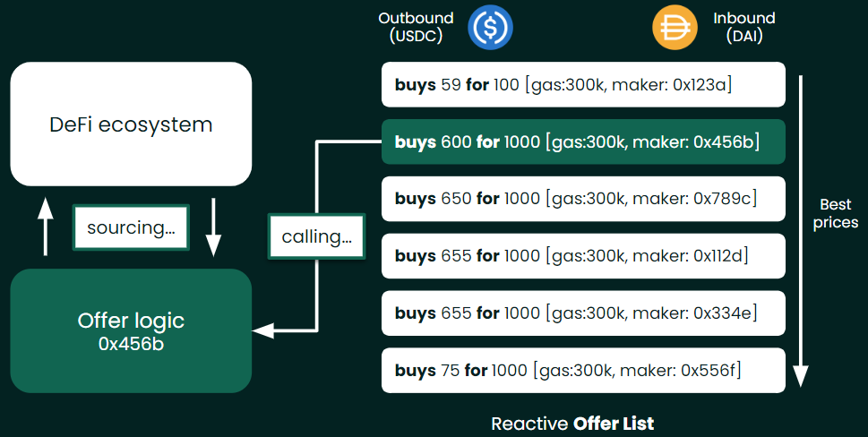

# Making liquidity available

An offer on Mangrove usually points to a contract containing the [offer logic](../../technical-references/taking-and-making-offers/reactive-offer/maker-contract.mdx) and specifies what it is ready to deliver and its price. Offer are stored in [offer lists](../../technical-references/taking-and-making-offers/market.md).

### Creating & Updating offers

Any Ethereum account can offer liquidity on Mangrove. New offers are created through a `newOffer` function, and updated through `updateOffer`. The [Creating & Updating offers](../../technical-references/taking-and-making-offers/reactive-offer/README.mdx) section details how to use those Mangrove functions. Mangrove has a standard implemantation off [offer logic](../../technical-references/taking-and-making-offers/reactive-offer/maker-contract.mdx) called [MangroveOffer](mangrove-offer.md), that automatically reposts the residual of your offer, if the offer was not fully taken.

### Executing offers

After an offer has been created or updated, it can be executed by anyone. Upon execution, the offer's logic has an opportunity to source the liquidity it has promised. The Executing offers section details how to structure your contract code in order to respond when its offers are executed.

### Offer bounties

Since offers on Mangrove can fail, an ETH bounty is given to those who trigger failing offers, as compensation for the gas spent. This bounty is extracted from the offer's account deposit at Mangrove. The [Offer bounties](./#offer-bounties) section details how bounties work and how they are calculated.
