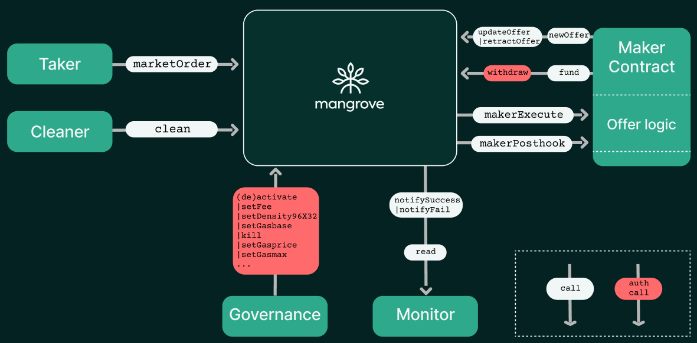

# Overview of Mangrove ecosystem

The illustration belows depicts a bird's-eye view of Mangrove ecosystem with the main actors as well as their most important interaction.

The three most important actors are:

* [Offer makers](#makers), via a **maker contract**, add [liquidity promises](../background/offer-maker.md) to Mangrove. The **offer logic** of the maker contract is called by Mangrove whenever the offer is matched by a taker order (see also the call sequence [overview](#call-sequence-overview)).
    
* [Takers](#takers) use Mangrove to [find liquidity](../background/offer-taker.md) by executing offers published on Mangrove.

* [Governance](#governance) adjusts Mangrove [parameters](./governance-parameters/README.md) such as setting fees or opening and closing markets.

## Takers

As a taker on Mangrove you take offers published by makers as liquidity promises. Offers can be taken using general [market orders](taking-and-making-offers/taker-order/README.md#market-order) or [sniped](taking-and-making-offers/taker-order/README.md#offer-sniping) individually.

Takers may typically operate via a web front-end or with the help of the TypeScript [SDK](../../SDK/README.md) for developing off-chain apps to interact with Mangrove ecosystem.

## Makers

Makers own [offers](taking-and-making-offers/reactive-offer/README.md), which live in [offer lists](taking-and-making-offers/offer-list.md) in Mangrove order book, that react to [offer execution](taking-and-making-offers/reactive-offer/executing-offers.md).

As a maker, when you post an offer your address is recorded on Mangrove and will be called back when your offer is matched by a taker order. If this address is that of [maker contract](taking-and-making-offers/reactive-offer/maker-contract.md) it will be given the opportunity to execute its %%offer logic|offer-logic%%. More precisely, the maker contract is called twice by Mangrove protocol: first [*when*](taking-and-making-offers/reactive-offer/maker-contract.md#trade-execution) your offer is [taken](taking-and-making-offers/taker-order/README.md), and a second time [*after*](taking-and-making-offers/reactive-offer/maker-contract.md#trade-posthook) your offer was taken.

### When an offer is taken

Mangrove calls the maker contract a [first time](taking-and-making-offers/reactive-offer/maker-contract.md#trade-execution), via the callback function `makerExecute`, when an offer is matched by a taker order. This allows makers to source the liquidity *just-in-time* for the trade. It also allows the makers to [renege](../background/taker-compensation.md) on the offer to trade (e.g, because the market conditions changed) by incorporating defensive code in the maker contract.

This implies that offers posted to Mangrove need not be fully provisioned. As a maker, your liquidity can be shared, borrowed, lent and, at the same time, be displayed in Mangrove's order book, ready to be sourced when, and only when, your offer is taken.

### After an offer is taken

Mangrove calls the maker contract a [second time](taking-and-making-offers/reactive-offer/maker-contract.md#offer-post-hook), via the callback function `makerPosthook`,  during the trade execution, *after* the offer has been taken.

This allows makers to repost an offer in order to publish their liquidity instantly, in a manner similar to Automated Market Makers (AMMs). 

## Call sequence overview

The diagram below summarizes the call sequence induced by a taker order. Notice that first `makerExecute` functions is executed for all offers, and only after that are the offer's `makerPosthook` functions executed.

## Where can I read more?

* Refer to the section on [Creating and Updating Offers](taking-and-making-offers/reactive-offer/README.md).
* Read more about [Offer Execution](taking-and-making-offers/reactive-offer/executing-offers.md) on Mangrove.
* Read about the freely available [Strat Library](../../strat-lib/README.md) - a repository of Solidity code to help write your own custom maker contract.
* Read about the TypeScript [SDK](../../SDK/README.md) for developing off-chain apps to interact with Mangrove ecosystem.

## Governance

The Mangrove Governance may set a number of parameters, which governs how Mangrove operates globally or for specific pairs. Refer to the section on [Governance Parameters](./governance-parameters/README.md) for details.

