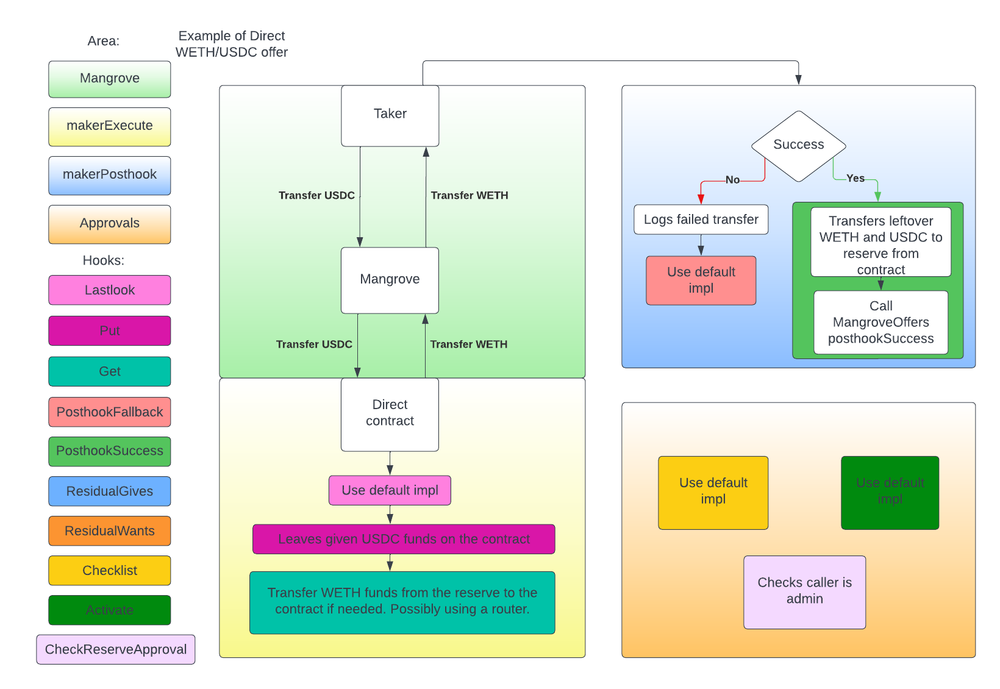

# Direct

Direct is an abstract implementation of [MangroveOffer](mangrove-offer.md), if you don't have a good understanding of MangroveOffer we recommend reading that page first.

Direct should be seen as an implementation that only works for one user, the admin of the contract. This means most calls are guarded, so only the admin can call them. Having only one user, simplifies the uses of the contract, since there is no need to keep track of who is posting offer, updating offers or retracting offers, it is always the admin.

Direct does many of the same things as MangroveOffer with a few key differences.

**How inbound tokens are handled (from the taker):** After the funds have been transferred from the taker to the Direct contract, it chooses to leave received funds on the contract's balance, until `makerPosthook` is called. The reason for leaving the funds on the contract is that multiple offers posted by this contract may be taken in the same market order. This will result in a cumulative amount of inbound tokens being on the contract's balance. Instead of transferring them during each call to `makerExecute`, it is cheaper in gas to wait until after all offers are taken, and then transfer all the funds left on the contract to the router.

**How outbound tokens are handled (for the taker):** When transferring the funds from the contract to the taker, Direct first tries to check if it itself has the funds, otherwise tries to get the funds using its %%router|router%% (if any).

**ReserveId:** Direct contracts have an immutable %%reserveId|reserve-id%% that is passed as an argument to its router (if using one) to identify where funds should be tranferred from and to during offer logic's execution. Field is immutable to save gas and to allow a single router to pool liquidity from various maker contracts. It is then sufficient to check that contract's deployer controls the reserveId at deploy time.

MangroveOffer has no implementations of how to post, update or retract an offer. Direct provides default internal implementations for these methods. 

