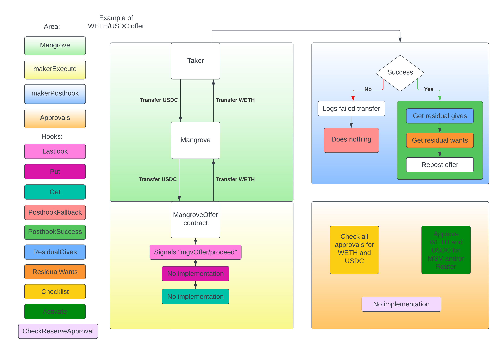

# MangroveOffer

:::info

The Strat Library offers a partial implementation of IOfferLogic called MangroveOffer. This implementation is an abstract contract, that reposts the residual of the offer, if the offer was not fully taken. This is done using the %%hooks|hook%% exposed by MangroveOffer. These hooks are separated in two categories: those whose overriding will change the %%offer logic|offer-logic%%'s execution, and the hooks that may be used to customize the administration and use of the %%maker contract|maker-contract%%. 

:::

## Offer owner's reserve

The **reserve** is where an offer logic should deposit %%inbound|inbound%% tokens and where %%outbound|outbound%% tokens will be fetched, depending on the %%offer's owner|offer-owner%%. By default the reserve of an offer owner is the offer owner's address. Advanced %%routers|router%% may use complex protocols, such as AAVE, as reserve. It is possible to change the default reserve of an offer owner (See [Direct](direct.md) or [Forwarder](forwarder.md)).

## Offer logic's hooks

When an offer is taken, Mangrove transfers the funds from the taker to Mangrove and from Mangrove to the contract that posted the offer. It is not possible to hook in before or in between these 2 transfers. When these 2 transfers are done, MangroveOffer, has 3 hooks. **lastlook**, **put** and **get**. They are called in this order.

### Pre trade hooks

* [Lastlook](../../technical-references/main-hooks.md#last-look-before-trade) is meant for having a lastlook before the funds are transferred to the taker. It then returns a value that `makerPosthook` can use, to get information of how e.g. the markets looked, when `makerExecute` was executed. This can be useful since, `makerPosthook` may be call several orders later. See [Executing offers](../../../contracts/technical-references/taking-and-making-offers/reactive-offer/executing-offers.md) for more information.

* [Put](../../technical-references/main-hooks.md#managing-takers-payment) is meant as an option for the maker to transfer the given funds from the contract to e.g. the reserve. This could be useful if you don't want to leave the funds on the contract.

* [Get](../../technical-references/main-hooks.md#sourcing-liquidity) is meant as an option for the maker to transfer the funds, promised to taker the, from e.g. the reserve to MangroveOffer contract. This could be useful if you don't want to have the promised funds laying on the contract.

### Post trade hooks

The next hooks are called doing `makerPosthook`. This i called after the offer is taken. `makerPosthook` has 2 hooks **posthookSuccess** and **posthookFallback**. When an offer is taken, it either succeeds in transferring the makers funds to the taker or it fails.

* [posthookSuccess](../../technical-references/main-hooks.md#posthook-after-trade-success): If it succeeds in transferring the funds from maker to taker, then the transaction was a success. `makerPosthook` then calls this hook. In this hook MangroveOffer has a default implementation, that reposts the taken offer, if the offer was only partially taken. It does this, by using 2 other hooks, called **residualGives** and **residualWants**. These hooks are used to calculate the new gives and wants for the reposted offer. MangroveOffers default implementation is to return the residual gives and wants of the taker offer. The reason for these being hooks, are that if the maker wants to repost the offer, with new gives and wants, even if the offer was fully taken. Then it will be possible to implement versions of **residualGives** and **residualWants** that returns the new gives and wants that the maker wants to use for the reposted offer. If **residualGives** return zero, then the offer will never be reposted.

* [posthookFallback](../../technical-references/main-hooks.md#posthook-after-trade-failure): If the offer fails to transfer the takers funds to the maker, then the transaction will revert. But if it fails trying to transfer the funds from the maker to the taker, then the taker will get a bounty. In this situation `makerPosthook` will emit a failed transfer and call the hook **posthookFallback**. MangroveOffers default implementation is empty. An example of what **posthookFallback** could be used for is, it could make sense to deprovision the offer, or even retract other offers on the book, that the maker now know will fail.

## Other maker contract's hooks

Besides having hooks that can be overriden to customize the offer logic, MangroveOffer also offers two additional hooks, namely **Activate** and **Checklist**. Before an offer can be taken on Mangrove, Mangrove needs to have the correct approvals to transfer the tokens from MangroveOffer contract to Mangrove. And if the contract is using a Router it also needs to approve the router to transfer the tokens from the contract. Both these hooks are helpers to setup the correct approvals.

* **Checklist** is a hook that is meant for checking if a token as the correct approvals. MangroveOffer always starts by checking if Mangrove and maybe the router has correct approvals. After this check, the hook gets called. An example of how to use this hook, would be if you are using a router that tries to lend the funds. This probably needs additional approvals, this hook should then check if those approvals are made.

* **Activate** is a hook that is meant for giving correct approvals for a token. MangroveOffer has a default implementation of the hook, that approves Mangrove and maybe the router, and then calls additional approvals on the router. An example of how to use this hook would be to, use the default implementation and also do additional approvals, e.g. if an extra address is used for transfers, then this address probably needs to be approved.

## Approvals

Here is list of all approval needed for MangroveOffer contract:

* MangroveOffer contract must approve Mangrove to transfer outbound tokens. (Done by activate)
* Mangrove contract must approve its router (if any) to transfer inbound tokens. (Done by activate)

Besides MangroveOffer contract giving approvals, the offer makers reserve needs to give this approval:

* The offer makers reserve of MangroveOffer contract must approve the router for outbound token transfer.

**CheckReserveApproval** is a hook that should check whether the reserve has approved the maker to use it. This is needed so that a maker don't use the reserve without the approval of the owner of the reserve. If this was allowed, it would be possible to set your reserve to the same as someone with a large amount of tokens and steal there tokens, when offers a taken. MangroveOffer has no default implementation. The hook is used, when the a maker tries to set their reserve.

* [routers](../../technical-references/router.md) are contracts, which can handle more comprehensive transfers. E.g. if you want to lend the money, when the offer is taken, then a router would be able to handle this. A more comprehensive description of Routers can be found here LINK.

Mangrove has 2 default implementations of MangroveOffer, they can be found here, [Direct](direct.md) and [Forwarder](forwarder.md).

