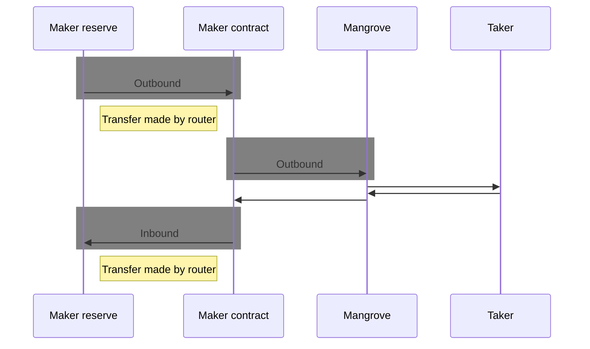

# Approvals

During trade settlement, Mangrove needs certain approvals for transferring funds between the offer taker and maker with Mangrove as an intermediary.

### Call sequence overview

In the following, we shall refer to the diagram depicting an [overview of the call sequence](../../contracts/technical-references/overview.md#call-sequence-overview) for a successful trade when a maker [offer is taken](../../contracts/technical-references/taking-and-making-offers/taker-order/README.md) with a market order. For easy reference, the diagram is included below. 

Refer to [Contracts -> Technical Reference -> Overview](../../contracts/technical-references/overview.md) and the pages linked there for more details on trade execution on Mangrove.

## Maker approvals

As a **maker** you either post %%on-the-fly|on-the-fly-offer%% offers directly from an EOA, or post %%smart offers|smart-offer%% connected to %%maker contracts|maker-contract%%.

As the Mangrove contract handles transfers during trade settlement, this means that either the maker EOA or the maker contract needs to approve Mangrove for an %%outbound|outbound%% token transfer for at least the amount that the offer %%gives|gives%%.

Referring to the [call sequence diagram](#call-sequence-overview) this maker approval is required for the `transferFrom` from the %%Offer Logic(s)|offer-logic%% to Mangrove.

### Maker contracts inheriting from `MangroveOffer`

Maker contracts inheriting from [MangroveOffer](../background/offer-maker/mangrove-offer.md) provide two methods to assist with approvals: 

* [`activate`](../technical-references/code/strategies/MangroveOffer.md#activate) performs the required approvals so as to allow the contract itself to interact with Mangrove on a set of assets.
* [`checklist`](../technical-references/code/strategies/MangroveOffer.md#checklist) verifies that this contract's current state is ready to be used by `msg.sender` to post offers on Mangrove.

### Advanced maker approvals

As drawn, the [call sequence diagram](#call-sequence-overview) depicts a situation where the funds for the smart offer are available directly on the maker contract holding the offer logic. However, for more advanced smart offers several smart contracts may come into play when liquidity is sourced.

As an outset, the administrator of the maker contract and any other contracts involved in trade settlement initiated by Mangrove must ensure that the proper approvals for liquidity flow is in place before offers are executed. 

For maker contracts that are built using the Strat Lib, the default behavior of the %%offer logic|offer-logic%% is to assume the funds will come from the offer owner %%reserve|reserve%%. If the address of the reserve is not the maker contract itself, then proper approvals need to be set up so that liquidity can be brought from there. There are two noteworthy cases we comment below.

#### When a Strat Lib router is used to manage the funds of the maker

As described under [Liquidity routing](../technical-references/router.md) the Strat Lib provides building blocks for advanced cash management strategies. The %%router|router%% abstraction is provided for managing transfers of %%outbound|outbound%% and %%inbound|inbound%% token reserves of %%offer owners|offer-owner%%.

For the maker contract it must approve its router for any token it wishes to push to an %%offer owner|offer-owner%%'s reserve. 

Strat Lib routers provide two methods to assist with their approvals:

* [`activate`](../technical-references/router.md#router-activation) performs all router-centric approvals necessary to route liquidity for a given token.
* [`checklist`](../technical-references/router.md#router-checklist) verifies that router has necessary approvals to route liquidity for a given token and a given reserve (see [below](#when-the-reserve-is-not-directly-on-the-maker-or-the-router) for more on reserve approvals).

Please refer to the section on [Routers](../technical-references/router.md) for more details, and refer to the API Reference for [AbstractRouter](../technical-references/code/strategies/routers/AbstractRouter.md) - the base that Strat Lib routers are implemented on top of.

#### When a Forwarder-based contract manages offers belonging to several offer owners

The [Forwarder](../background/offer-maker/forwarder.md) building block provides a base for maker contracts that manages offers belonging to several offer owners.

A basic Forwarder strategy is to assume that each offer owner's %%reserve|reserve%% is actually the offer owner's address. In such cases, the offer owners need to approve the maker contract or its %%router|router%% (if it has one) for outbound token transfer. 

In particular, for contracts based on the [Forwarder](../background/offer-maker/forwarder.md) building block the usage of a %%liquidity router|router%% is *required*  - so in this case, the offer owners need only consider approval for the router of the `Forwarder` contract.

Please refer to the section on the [Forwarder building block](../background/offer-maker/forwarder.md) and to the API Reference for the [Forwarder](../technical-references/code/strategies/offer_forwarder/abstract/Forwarder.md) base for further reading.

<!-- #### Example -->

The schematic diagram below illustrates the case, where a maker contract manages offers with a %%router|router%% and external %%offer reserves|reserve%%. Such a maker contract may be implemented with the [Forwarder](../background/offer-maker/forwarder.md) building block combined with a %%router|router%%.

In this case, 
* the router needs approval to transfer outbound from the Maker reserve and needs approval to transfer inbound from the maker contract. 
* Mangrove needs approval to transfer outbound from the Maker contract.

This is illustrated in the diagram below where we only focus on the `transferFrom` calls.

## Taker approvals

While we are mainly focused on the maker-side in this section, it is worth noting that the offer taker (be that an EOA or a contract) needs to approve Mangrove for an %%inbound|inbound%% token transfer for at least the amount of tokens that the taker gives.

Looking at the [call sequence diagram](#call-sequence-overview) this taker approval is required for the `transferFrom` from the Taker to Mangrove.

