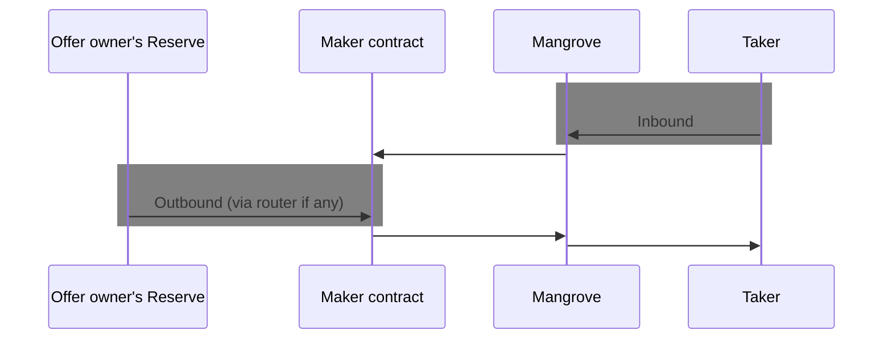

# Approvals

Mangrove needs approvals for transferring funds from offer taker to the %%maker contract|maker-contract%% and during trade settlement, from maker contract to offer taker, (see [sequence example](../../contracts/technical-references/overview.md#call-sequence-overview)).

## Maker side approvals

Maker contract (or EOA posting an %%on-the-fly|on-the-fly-offer%% offer) need to approve Mangrove for %%outbound|outbound%% token transfer for at least the amount that the offer %%gives|gives%%.

## Taker side approvals

Offer takers (EOA or contracts) need to approve Mangrove for %%inbound|inbound%% token transfer for at least the amount of tokens that the taker gives. 

## Other approvals

The admin of a maker contract must make sure the contract itself has the required approvals.

* %%Router|router%% approvals: the maker contract must approve its router (if any) for any token it wishes to push to an %%offer owner|offer-owner%%'s reserve.
* %%Reserve|reserve%% approvals: offer owner's reserve need to approve the maker contract or its router (if it has one) for outbound token transfer. This additional approval is not required if the reserve is the router, or the maker contract.

[MangroveOffer](offer-maker/mangrove-offer.md) has 2 methods to help with this, [activate](../technical-references/code/strategies/MangroveOffer#activate) will make all necessary approvals for the given token and [checklist](../technical-references/code/strategies/MangroveOffer#checklist) will check that the given token has the necessary approvals. The SDK has a similar helper, [activate](../../SDK/technical-references/code/classes/OfferLogic#-activate).

### Approval summary
Greyed zones require approval for the source to target of the arrow. 

