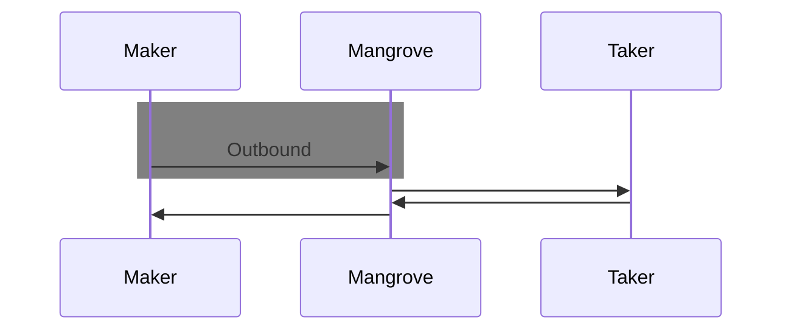
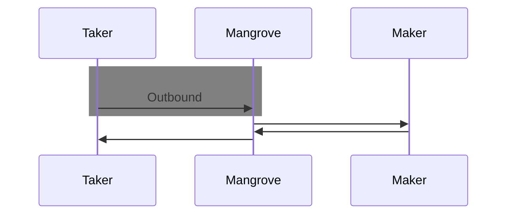
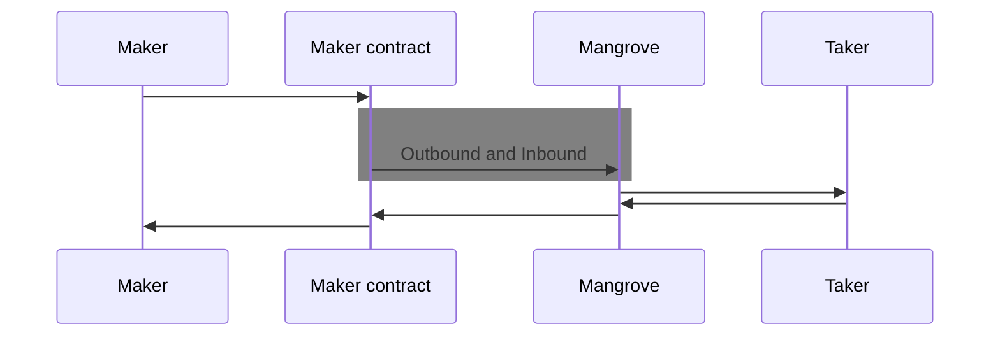
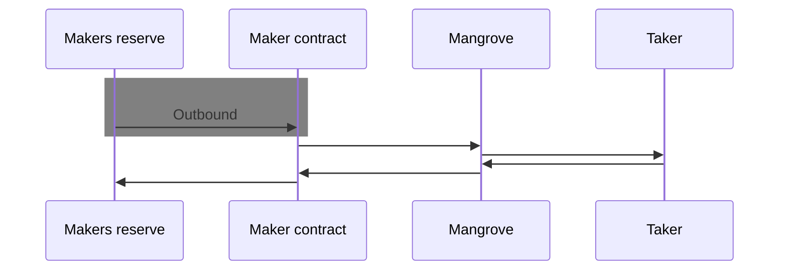
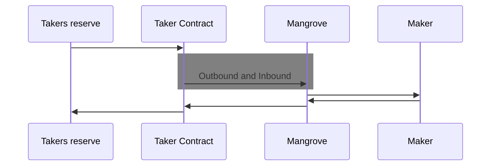
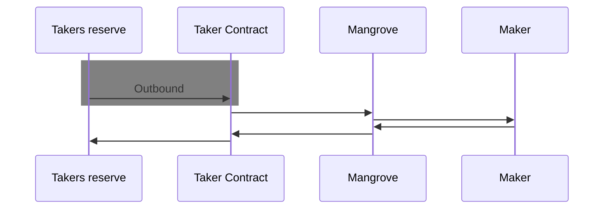
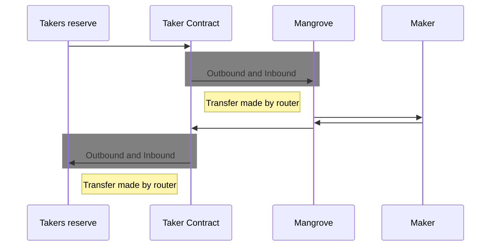
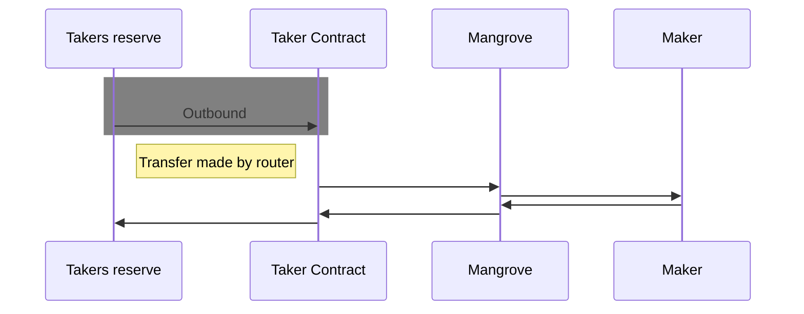

# Approvals

## Intro

This section will show what to approve, in different scenarios. E.g., if you are a Admin of a contract, Maker or Taker. I general you can use Mangrove in 2 ways, either directly or through a contract. Either way, the first thing Mangrove does is to transfer from you/an EOA or from a contract to Mangrove and the last thing is to transfer from Mangrove back to you or the contract. This means that Mangrove needs approvals for transferring funds on behalf of either you or the contract. If you are using a contract, additional approval might be needed.

### Making an offer directly on Mangrove

When making an offer using Mangrove directly, you only have to approve Mangrove for the token Mangrove will take from your account. E.g., are you making a DAI-USDC offer, where you want to sell some DAI. Then you should approve Mangrove to transfer DAI from your account

### Taking an offer directly on Mangrove

When taking an offer using Mangrove directly, you only have to approve Mangrove for the token Mangrove will take from your account. E.g., are you taking a DAI-USDC offer, where you want to buy some DAI for USDC. Then you should approve Mangrove to transfer USDC from your account.

### Admin of a Maker contract without a router

When you are an admin of a contract that can make offers, then you need to make sure that the contract itself has made the correct approvals. In this case we are not using a %%router|router%%, so we only need to approve Mangrove to make transfer from the contracts account. E.g., if the contract can make offers on the DAI-USDC market, then you need to makes sure that the contract has approved Mangrove for DAI and USDC transfers. [MangroveOffer](offer-maker/mangrove-offer.md) offers 2 methods to help with this, [activate](../technical-references/code/strategies/MangroveOffer#activate) will make all necessary approvals for the given token and [checklist](../technical-references/code/strategies/MangroveOffer#checklist) will check that the given token has the necessary approvals. The SDK has a similar helper, [activate](../../SDK/technical-references/code/classes/OfferLogic#-activate).

### Making an offer using a Maker contract without a router

When making an offer using a contract without a router, you only need to approve that the maker contract can transfer the outbound token from the makers [reserve](../explanations/offer-maker/mangrove-offer#offer-owners-reserve). If the maker didn't set any reserve, then the reserve will be the makers own address. E.g., if you want to make an DAI-USDC offer where you are selling DAI, then you need to approve that the maker contract can take DAI from the makers reserve.

### Admin of a Taker contract without a router

When you are an admin of a contract that can take offers, then you need to make sure that the contract itself has made the correct approvals. In this case we are not using a router, so we only need to approve Mangrove to make transfer from the contracts account. E.g., if the contract can take offers on the DAI-USDC market, then you need to makes sure that the contract has approved Mangrove for DAI and USDC transfers.

### Taking an offer using a Taker contract without a router

When taking an offer using a contract without a router, you only need to approve that the taker contract can transfer the outbound token from the takers reserve. If the taker didn't set any reserve, then the reserve will be the takers own address. E.g., if you want to take an DAI-USDC offer where you are buying DAI for USDC, then you need to approve that the taker contract can take USDC from the takers reserve.

### Admin of a Maker contract with a router

When you are an admin of a contract that can make offers, then you need to make sure that the contract itself has made the correct approvals. In this case we are using a %%router|router%%, so we not only need to approve Mangrove to make transfer from the contracts account. But we also need to approve the router to transfer funds from the contract to the makers reserve. E.g., if the contract can make offers on the DAI-USDC market, then you need to makes sure that the contract has approved Mangrove and the router for DAI and USDC transfers. [MangroveOffer](offer-maker/mangrove-offer.md)'s helper functions ([activate](../technical-references/code/strategies/MangroveOffer#activate) and [checklist](../technical-references/code/strategies/MangroveOffer#checklist)) also handles router approvals.

### Making an offer using a Maker contract with a router

When making an offer using a contract with a router, you should not approve the contract for transfers, but the router. This means that you need to approve the router of the contract, to transfer the outbound token on behalf the makers reserve. If the maker didn't set any reserve, then the reserve will be the makers own address. E.g., if you want to make an DAI-USDC offer where you are selling DAI, then you need to approve that the maker contract's router can take DAI from the makers reserve.

### Admin of a Taker contract with a router

When you are an admin of a contract that can take offers, then you need to make sure that the contract itself has made the correct approvals. In this case we are using a %%router|router%%, so we not only need to approve Mangrove to make transfer from the contracts account. But we also need to approve the router to transfer funds from the contract to the takers reserve. E.g., if the contract can take offers on the DAI-USDC market, then you need to makes sure that the contract has approved Mangrove and the router for DAI and USDC transfers.

### Taking an offer using a Taker contract with a router

When taking an offer using a contract with a router, you should not approve the contract for transfers, but the router. This means that you need to approve the router of the contract, to transfer the outbound token on behalf the takers reserve. If the taker didn't set any reserve, then the reserve will be the takers own address. E.g., if you want to take an DAI-USDC offer where you are buying DAI for USDC, then you need to approve that the taker contract's router can take USDC from the takers reserve.

